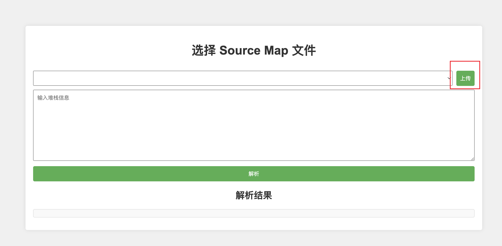
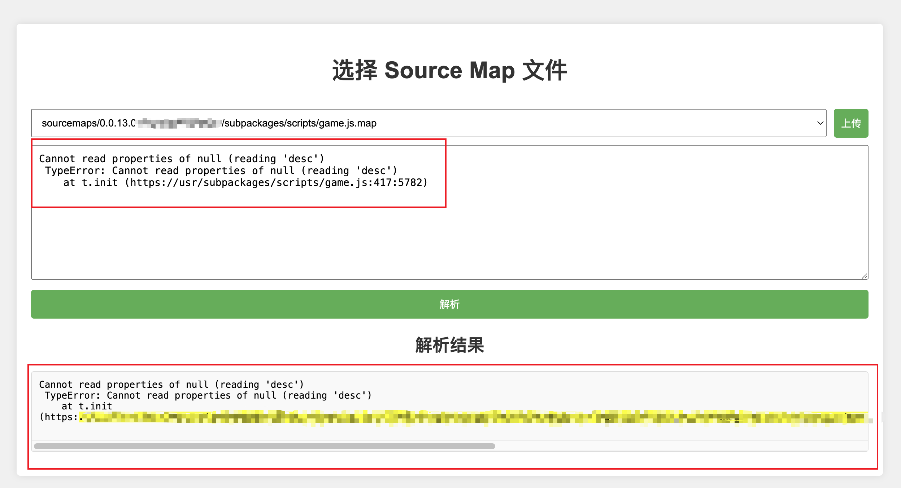

## Sourcemap Parser

### 项目简介

Sourcemap Parser 是一个用于解析 JavaScript 源映射文件的工具。通过该服务，你可以将压缩后的 JavaScript 错误信息映射回源文件的具体位置，便于调试和排查问题。

### 背景
在前端开发中，通常会将 JavaScript 代码进行压缩和混淆以减小文件大小和提高安全性。但这样做会导致调试和排查问题变得困难，因为压缩后的代码与源文件之间没有直接映射关系。
Sourcemap Parser 就是为了解决这个问题而生的。它可以将压缩后的 JavaScript 错误信息映射回源文件的具体位置，方便开发者进行调试和排查问题。

一般例如微信开发者工具等第三方平台均支持上传sourcemap进行对应的错误信息进行解析后展示,也支持输入行号等信息查找源文件位置.但是自建日志系统.或者完整查询一段trace统一解析的需求暂无好的工具进行支持
本项目应运而生,旨在解决高效解析整段trace信息的需求.

### 功能概述
- **Sourcemap压缩文件上传**：将sourcemap.zip文件上传到服务器.支持Api上传及网页上传,打包自动化接入
- **手动错误信息解析**：网页端解析上传的 `sourcemap` 文件和错误堆栈信息，返回详细的错误位置。
- **自动错误信息解析**：地址支持trace,version,match三个参数,能够丝滑对接日志平台,报错平台等第三方跳转.实现一键解析
- **API 接口**：提供了一套方便使用的 API 接口，用于管理和解析源映射文件。

### 截图说明功能

以下是应用的一些功能截图：

#### 上传 sourcemap.zip 文件页面



#### 上传 完成后可以选择压缩包中的map文件文本进行解析



## 目录结构

```
sourcemap-parser/
├── public/
│   └── index.html              # 示例静态文件
├── scripts/                    # 启动和停止脚本目录
│   └── service-control.sh      # 启动和停止脚本
├── sourcemaps/                 # 存储源映射文件
├── .dockerignore               # Docker 忽略文件列表
├── app.js                      # 应用主文件
├── docker-compose.yml          # Docker Compose 配置文件
├── Dockerfile                  # Docker 配置文件
├── README.md                   # 项目文档
└── docs/
    ├── API.md                  # API 接口文档
    └── assets/
        └── screenshots/        # 截图文件夹
```

## 快速开始

### 环境要求

- [Docker](https://www.docker.com/) (需要安装 Docker 引擎)
- [Docker Compose](https://docs.docker.com/compose/)

### 获取代码

```bash
git clone https://github.com/hlxabcd/sourcemap-parser.git
cd sourcemap-parser
```

### 启动服务

1. 确保 Docker 引擎正在运行。
2. 运行以下命令启动服务：

```bash
./scripts/service-control.sh start
```

### 停止服务

运行以下命令停止服务：

```bash
./scripts/service-control.sh stop
```

## 使用说明

### 访问应用

在浏览器中打开 [http://localhost:3000](http://localhost:3000) 以访问应用。

### API 接口

有关 API 接口的详细说明请参见 [API 文档](./docs/API.md).

## 贡献

欢迎贡献代码！请提交 Pull Request 或报告 Issue 以帮助改进项目。

1. Fork 仓库
2. 创建新分支 (`git checkout -b feature/some-feature`)
3. 提交更改 (`git commit -am 'Add some feature'`)
4. 推送到分支 (`git push origin feature/some-feature`)
5. 提交 Pull Request

## 许可证

该项目基于 [MIT 许可证](LICENSE) 开源。

## 联系方式

如有任何问题或建议，请通过 [hlxabcd@sina.com](mailto:hlxabcd@sina.com) 联系我们。

---

感谢使用 Sourcemap Parser！我们希望这个工具能帮助你更好地调试和排查 JavaScript 错误。

---